<!-- Add this anywhere in your Markdown file -->
<script type="module">
  import mermaid from 'https://cdn.jsdelivr.net/npm/mermaid@10/dist/mermaid.esm.min.mjs';
  mermaid.initialize({ startOnLoad: true, flowchart: { useMaxWidth: false , "htmlLabels": false} });
</script>

# IBM Data Science Capstone Project

Cong Wang
2023-12-04

---

# Outline

- Executive Summary
- Introduction
- Methodology
- Results
- Conclusion
- Appendix

---

# Executive Summary

## Project Stages

1. **Data Gathering:**
2. **Data Cleaning and Transformation:**
3. **Exploratory Data Analysis:**
4. **Interactive Visual Data Exploration:**
5. **Predictive Analysis (Classification):**

## Project result

- Explored data through EDA.
- Conducted geospatial analysis and Created an interactive dashboard.
- Developed four ML models with **~83.33%** accuracy.
- Models tended to over-predict successful landings, indicating the need for more data.

---

# Introduction

## Background

SpaceX has disrupted the space industry by offering significantly lower launch costs ($62 million vs. $165 million USD), largely due to successful rocket stage recovery.

## Challenge

Space Y aims to compete with SpaceX and has tasked us with training a machine learning model to predict the success of the Falcon 9 first stage recovery.

## Objective

This project seeks to predict the success of SpaceX Falcon 9 first stage landings, enabling cost estimation and informed competition in the commercial space launch market.

---

# Section 1:

# Methodology

---

# Summary of Data Analysis Methodology

## Data Collection

<div class="columns">
<div>

- **SpaceX API & Wikipedia**: Combined data from SpaceX public API and SpaceX Wikipedia page.
- **GET requests**: Making GET requests to the SpaceX REST API.
- **Web Scraping**: Extracting additional data.

## Data Wrangling

- **Value Counts**: Applied `.value_counts()` to analyze the data.

## Exploratory Data Analysis (EDA)

- **SQL Queries**: Manipulated and evaluated the SpaceX dataset.
- **Pandas & Matplotlib**: Visualized relationships and patterns.
</div>
<div>

## Interactive Visual Analytics

- **Folium**: Performed geospatial analytics.
- **Plotly Dash**: Created an interactive dashboard.

## Data Modelling and Evaluation

- **Scikit-Learn**: Pre-processing and data splitting.
- **Model Training**: Employed classification models.
- **Hyperparameter Tuning**: Utilized GridSearchCV.
- **Model Assessment**:
  - Confusion matrices for model evaluation.
  - Accuracy assessment for each model.
  </div>
  </div>

---

# Data Collection

## Space X Data Acquisition

### 1. API Data Collection

- **Source**: Space X Public API
- **Columns**:
  - `FlightNumber`, `Date`, `BoosterVersion`, `PayloadMass`
  - `Orbit`, `LaunchSite`, `Outcome`, `Flights`, `GridFins`
  - `Reused`, `Legs`, `LandingPad`, `Block`, `ReusedCount`
  - `Serial`, `Longitude`, `Latitude`

### 2. Web Scraping

- **Source**: Space X Wikipedia Entry
- **Columns**:
  - `Flight No.`, `Launch site`, `Payload`, `PayloadMass`
  - `Orbit`, `Customer`, `Launch outcome`, `Version Booster`
  - `Booster landing`, `Date`, `Time`

---

# Data Collection - SpaceX Public API

<div class="columns">
<div>

## REST API

- This project involves integrating with the SpaceX API to gather comprehensive data on their launches. The process begins by making a GET request to the SpaceX REST API to obtain detailed information about various aspects of each launch. This includes data on the rocket, the payload, launch and landing specifics, and the result of the landing. The received data is then converted into a JSON format and subsequently into a Pandas DataFrame for ease of manipulation and analysis.

- [github](https://github.com/nickwang5h/ibm_data_science_final/blob/main/jupyter-labs-spacex-data-collection-api.ipynb)
</div>

<div class="mermaid" style="text-align: center">
flowchart TD
    A[GET Request to SpaceX API] --> B[Convert to JSON file]
    B --> C[Load to Pandas dataframe]
    C --> D[Clean Data]
    D --> E[Retrieve Data]
    E --> F[Store in Dictionary]
    F --> G[Finalize DataFrame]
</div>
</div>

---

# Data Collection - Scraping

## Wikipedia

<div class="columns">
<div>

- In this project, the primary goal is to perform web scraping for collecting historical launch records of Falcon 9 from the Wikipedia page titled "List of Falcon 9 and Falcon Heavy launches." The process begins by requesting the HTML page from its static URL and storing the response in a designated object.

- [github](https://github.com/nickwang5h/ibm_data_science_final/blob/main/jupyter-labs-webscraping.ipynb)

</div>
<div>
<div class="mermaid" style="text-align: center">
flowchart TD
    A[GET Request to Wikipedia page] --> B[BeautifulSoup & html5lib parser]
    B --> C[Lauches table]
    C --> D[Create dictionary]
    D --> E[Retrieve Data into Dictionary]
    E --> F[Transform into DataFrame]
</div>
</div>

---

# Data Wrangling Process

1. **Data Loading and Inspection:**

   - Load the SpaceX dataset.
   - Inspect the dataset for structure and columns.

2. **Number of Launches on Each Site:**

   - Count the number of launches at each site using `.value_counts()` on 'LaunchSite'.

3. **Number and Occurrence of Each Orbit:**

   - Count the occurrences of each orbit type using `.value_counts()` on 'Orbit'.

4. **Number and Occurrence of Landing Outcome per Orbit Type:**

   - Filter the data for each orbit type and count landing outcomes within each subset.

5. **Create the Training Label 'class':**
   - Create a new 'class' column based on specified conditions:
     - If 'Mission Outcome' is True, set 'class' to 1.
     - For other cases, set 'class' to 0.

- [github](https://github.com/nickwang5h/ibm_data_science_final/blob/main/labs-jupyter-spacex-Data%20wrangling.ipynb)

---

# Exploratory data analysis (EDA) with Data Visualization

## Exploratory Data Analysis Summary

- **Variables Analyzed**: Flight Number, Payload Mass, Launch Site, Orbit, Class, Year.
- **Plots Utilized**:
  - Scatter plots: Flight Number vs. Payload Mass, Payload Mass vs. Launch Site, Payload vs Orbit.
  - Line charts: Orbit vs. Success Rate, Success Yearly Trend.
  - Bar plots: Flight Number vs. Launch Site, Flight Number vs. Orbit.
- **Purpose**: To examine relationships between variables for potential use in training machine learning models.

- [github](https://github.com/nickwang5h/ibm_data_science_final/blob/main/jupyter-labs-eda-dataviz.ipynb.jupyterlite.ipynb)

---

# EDA with SQL Queries

- **Database Integration**: Loaded dataset into IBM DB2; utilized SQL and Python integration for querying.
- **Data Exploration**:
  - Obtained information on launch site names, mission outcomes, payload sizes, booster versions, and landing outcomes.
- **Key SQL Queries**:

  - Identified unique space mission launch sites.
  - Retrieved 5 records of launch sites starting with 'CCA'.
  - Calculated total payload mass by NASA (CRS) boosters.
  - Computed average payload mass for booster version F9 v1.1.
  - Determined date of first successful ground pad landing.
  - Listed boosters with successful drone ship landings and payloads of 4000-6000 kg.
  - Counted total successful vs. failed mission outcomes.
  - Identified boosters with maximum payload mass.
  - Analyzed failed drone ship landings, including booster and launch site details (2015).
  - Ranked landing outcomes from 2010-06-04 to 2017-03-20 in descending order.

- [github](https://github.com/nickwang5h/ibm_data_science_final/blob/main/jupyter-labs-eda-sql-coursera_sqllite.ipynb)

---

# Build an Interactive Map with Folium

## Interactive Map Creation with Folium

This presentation outlines the process of developing an interactive map using Folium to analyze rocket launch sites. The map highlights launch sites, differentiates between successful and unsuccessful landings, and examines proximity to critical infrastructures like railways, highways, coasts, and cities. This approach provides insights into the strategic placement of launch sites and the success rates of landings based on their locations.

Key steps in the map creation include:

- Marking all launch sites with folium.Circle and folium.Marker on a Folium Map.
- Visualizing successful and failed launches by clustering launch points with similar coordinates and marking them with color-coded markers (green for success, red for failure).
- Calculating and displaying distances from each launch site to nearby essential facilities. This is achieved by using latitude and longitude values to place markers and drawing folium.PolyLine to represent distance lines.

Through these steps, the map serves as an interactive tool for comprehensively understanding launch site selections and their operational outcomes.

---

# Build a Dashboard with Plotly Dash

## Dashboard Visualization Summary

- **Pie Chart**:

  - Displays distribution of successful landings across all launch sites.
  - Offers individual launch site success rate visualization.
  - Built with Plotly's `px.pie()`.
  - Features a filter for site-specific success/failure ratio using `dcc.Dropdown()`.

- **Scatter Plot**:
  - Illustrates the relationship between launch outcomes and payload mass.
  - Allows selection between all sites or individual sites.
  - Payload mass adjustable via a slider (0 - 10,000 kg).
  - Created using `px.scatter()`.
  - Includes filters for payload mass ranges (`RangeSlider()`) and booster version.

These interactive elements enhance the Plotly Dash dashboard, enabling dynamic data exploration.

---

# Predictive Analysis (Classification)

<div class="columns">
<div>

## 1. **Model Development**

- **Data Preparation**
  - Load and preprocess dataset (standardization included).
  - Divide dataset into training and test sets using `train_test_split()`.
- **Algorithm Selection**
  - Identify suitable machine learning algorithms.
- **Parameter Tuning**
  - For each algorithm:
    - Implement `GridSearchCV` for hyperparameter optimization.

## 2. **Model Evaluation**

- For each algorithm:
  - Utilize `GridSearchCV` results to:
    - Determine optimal hyperparameters (`best_params_`).
    - Assess model accuracy (`score` and `best_score_`).

## 3. **Selecting the Best Model**

- Compare accuracy scores across all algorithms.
- Highest accuracy indicates the best performing model.

</div>
<div>
<div class="mermaid" style="text-align: center">
flowchart TD
 B[Load and Preprocess Dataset]
    B --> C[Split Dataset: Train and Test]
    C --> D[Select Machine Learning Algorithms]
    D --> E[Parameter Tuning with GridSearchCV]
    E --> F[Train Model with Training Data]
    F --> G[Evaluate Model with Test Data]
</div>
</div>

---

# Results

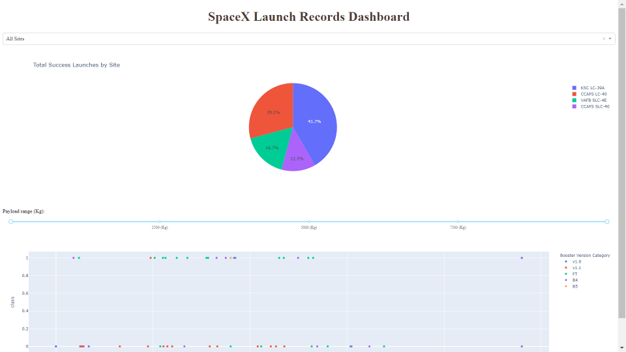

This preview offers a glimpse of our Plotly dashboard, showcasing key insights. In the upcoming slides, we'll delve into our EDA results, utilizing both visualization and SQL analysis. We'll also explore an interactive map powered by Folium. To conclude, we'll present our model's performance, boasting an impressive 83% accuracy rate.

---

# Section 2

# Insights drawn from the EDA

---

# Flight Number vs. Launch Site

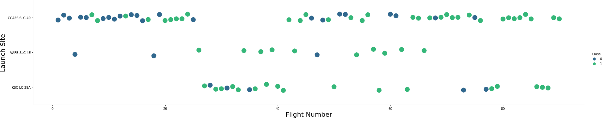

- **Success Rate:** Increasing trend in success rate over time, visible in flight numbers. Significant improvement post Flight 20.
- **Launch Sites:**
  - **CCAFS:** Primary site, high volume of early flights (<30), initially low success.
  - **VAFB:** Similar trend to CCAFS, with early flights being less successful.
  - **KSC:** No early flights; higher success rate for later launches.
- **Key Insight:** Post Flight 30, notable rise in successful landings (Class = 1).

---

# LAUNCH SITE vs. PAYLOAD MASS

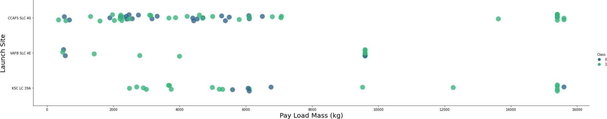

- **Payload Mass Range**: Predominantly 0-6000 kg across various sites
- **Scatter Plot Insights**:
  - Above 7000 kg payload, fewer unsuccessful landings, but limited data
  - No evident correlation between payload mass and success rate per site
  - CCAFS SLC 40 majorly launches lighter payloads with some exceptions

---

# Success Rate vs. Orbit Type

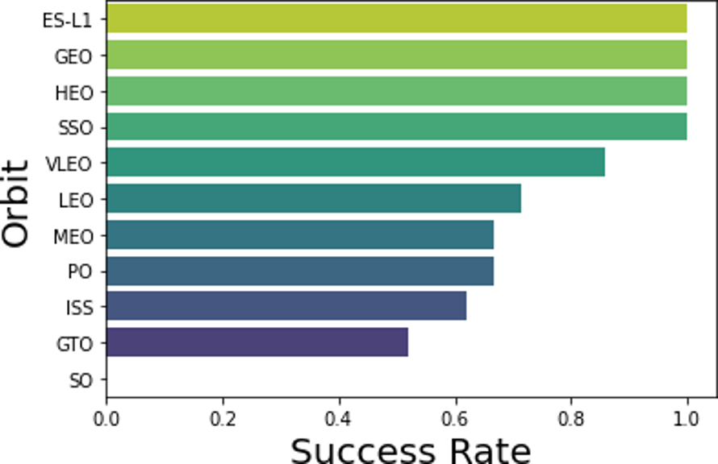

- **Orbit Types with 100% Success Rate:**
  - ES-L1 (Earth-Sun First Lagrangian Point, Sample Size: 1)
  - GEO (Geostationary Orbit, Sample Size: 1)
  - HEO (High Earth Orbit, Sample Size: 1)
  - SSO (Sun-synchronous Orbit, Sample Size: 5)
- **Other Notable Orbits:**
  - VLEO (Very Low Earth Orbit): Decent success rate with 14 attempts.
  - GTO (Geostationary Transfer Orbit): Around 50% success rate, the largest sample size of 27.
- **Lowest Success Rate:**
  - SO (Heliocentric Orbit): 0% success rate (Sample Size: 1)

_The bar chart in the presentation illustrates these success rates in relation to the orbit types._

---

# Orbit Type vs. flight number

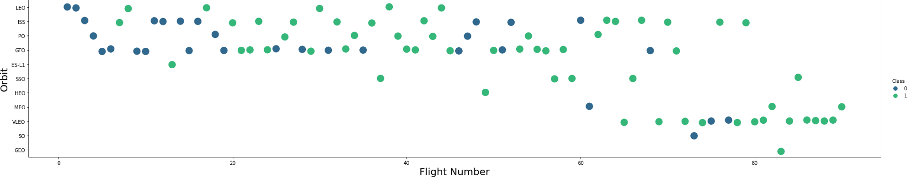

- **Key Insights:**

  - Change in orbit preference over flight number correlates with launch outcomes.
  - Initial focus on LEO orbits with moderate success, shifting to VLEO in recent launches.
  - Higher performance in lower orbits (LEO, SSO) and Sun-synchronous orbits.

- **Orbit Type vs. Flight Number:**
  - GEO, HEO, ES-L1 orbits: 100% success rate with only one flight each.
  - SSO: Notable 100% success across 5 flights.
  - GTO: Minimal correlation between flight number and success rate.
  - LEO: Increasing success rate with flight number; early launches saw more failures.

---

# ORBIT TYPE VS. PAYLOAD MASS

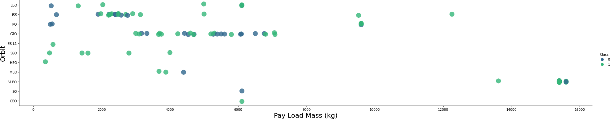

- **Key Observations**:

  - Higher payload masses often linked to successful launches.
  - LEO (Low Earth Orbit) and SSO (Sun-Synchronous Orbit) generally feature lower payload masses.
  - VLEO (Very Low Earth Orbit) predominantly associated with higher payload masses.

- **Orbit Success with Heavy Payloads**:

  - PO (Polar Orbit): Limited data but shows success.
  - ISS (International Space Station): Frequent success.
  - LEO: Notable success rate.

- **Ambiguities**:
  - GTO (Geostationary Transfer Orbit): Success correlation with payload mass is indeterminate.

**Conclusion**: Payload mass appears to be a significant factor in launch success, particularly in certain orbits like VLEO.

---

# Launch Success Yearly Trend


- **Confidence Interval:** Highlighted with light blue shading, indicating a 95% confidence level.
- **Trend Analysis:** Success rates have generally risen since 2013, with minor declines noted in 2018.
- **Recent Performance:** Approximately 80% success rate in recent years.
- **Historical Data:**
  - **2010-2013:** 0% success rate, indicating all landings during this period were unsuccessful.
  - **Post-2013:** Noticeable improvement in success rates, surpassing 50% after 2016.
  - **2018 and 2020:** Brief periods of reduced success.

---

# All Launch Site Names

<div class="columns">
<div>

- **SQL Statement:**
  ```SQL
  select DISTINCT LAUNCH_SITE from SPACEXDATASET
  ```
- **Purpose:** Extracts only distinct values from the `LAUNCH_SITE` column in the `SPACEXDATASET` table.
- **Key Insights:**
  - Possible Data Entry Errors: `CCAFS SLC-40` and `CCAFSSLC-40` likely refer to the same site.
  - Historical Naming: `CCAFS LC-40` is a former name.
  - Expected Unique Values: `CCAFS SLC-40`, `KSC LC-39A`, `VAFB SLC-4E`.

</div>
<div>

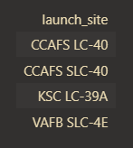

</div>
</div>

---

# Launch Site Names Begin with 'CCA'

<div class="columns">
<div>

- **SQL Statement:**

  ```SQL
  select * from SPACEXDATASET where launch_site like 'CCA%' limit 5
  ```

- **Objective:** Retrieve the first five entries where the Launch Site name begins with 'CCA'.
- **Method:** Utilize `LIMIT 5` to fetch only the top 5 records.
- **Filter:** Apply `LIKE 'CCA%'` to select records where the Launch Site name starts with 'CCA'.

</div>
<div>

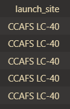

</div>
</div>

---

# Total Payload Mass

<div class="columns">
<div>

- **SQL Statement:**

  ```SQL
  select sum(payload_mass__kg_) as sum
  from SPACEXDATASET
  where customer like 'NASA (CRS)'
  ```

- **NASA Payload Mass Calculation:** This query calculates the total mass of payloads, in kilograms, launched by NASA.
- **CRS Context:** CRS (Commercial Resupply Services) relates to payloads delivered to the International Space Station (ISS).
- **Usage of SUM Keyword:** The SUM keyword aggregates the total mass from the LAUNCH column, specifically filtering for NASA (CRS) boosters.

</div>
<div>

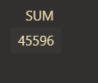

</div>
</div>

---

# Average Payload Mass by F9 v1.1

<div class="columns">
<div>

- **SQL Statement:**

  ```SQL
  SELECT AVG(payload_mass__kg_) AS Average
  FROM SPACEXDATASET
  WHERE booster_version LIKE 'F9 v1.1%'
  ```

- **Purpose:** This SQL query is designed to determine the average payload mass carried by the SpaceX booster version F9 v1.1. By utilizing the AVG function, it calculates the mean payload mass, specifically for launches using this booster variant.
- **Insight:** The average payload mass for F9 v1.1 is on the lower end of SpaceX's payload mass spectrum, indicating a specific use case or capacity for this booster version.
</div>
<div>


</div>
</div>

---

# First Successful Ground Landing Date

<div class="columns">
<div>

- **SQL Statement:**

  ```SQL
  select min(date) as Date
  from SPACEXDATASET
  where landing__outcome like 'Success (ground pad)'
  ```

  - **Purpose:** This SQL statement retrieves the date of SpaceX's first successful ground pad landing. The initial ground pad landing was achieved towards the end of 2015, although successful landings began occurring from 2014. The `MIN` function is utilized to find the earliest date, while the `WHERE` clause filters for missions marked as 'Success', focusing specifically on successful ground pad landings.
  </div>
  <div>


</div>
</div>

---

# Successful Drone Ship Landing with Payload between 4000 and 6000

<div class="columns">
<div>

- **SQL Statement:**

  ```SQL
  select booster_version from SPACEXDATASET
  where (mission_outcome like 'Success')
  AND (payload_mass__kg_ BETWEEN 4000 AND 6000)
  AND (landing__outcome like 'Success (drone ship)')
  ```

  The provided SQL statement extracts booster versions from the SpaceX dataset with specific criteria. It selects records where the mission outcome is 'Success', the payload mass ranges between 4000 and 6000 kg (exclusive), and the landing outcome is 'Success (drone ship)'. The query effectively filters for successful drone ship landings with a payload in the specified mass range, showcasing the use of `WHERE`, `AND`, and `BETWEEN` clauses for precise data filtering.
  </div>
  <div>


</div>
</div>

---

# Total Number of Successful and Failure Mission Outcomes

<div class="columns">
<div>

#### SQL Query Overview

```SQL
SELECT mission_outcome, count(*) as Count
FROM SPACEXDATASET
GROUP by mission_outcome
ORDER BY mission_outcome
```

- **Key Findings:**
  - The query calculates the total number of each mission outcome.
  - SpaceX achieves its mission objectives nearly 99% of the time.
  - A majority of landing failures seem to be part of the plan.
  - One mission had an ambiguous payload status.
  - Unfortunately, there was one in-flight failure.

This analysis underscores SpaceX's high success rate and strategic approach to mission planning.

</div>
<div>

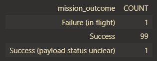

</div>
</div>

---

# Boosters Carried Maximum Payload

<div class="columns">
<div>

- **SQL Statement:**

  ```SQL
  select booster_version
  from SPACEXDATASET
  where payload_mass__kg_=(select max(payload_mass__kg_)
                            from SPACEXDATASET)
  ```

- **Purpose**: Identifies F9 B5 B10xx.x booster versions with the maximum payload mass of 15,600 kg.
- **Observation**: High payload mass seems to be associated with specific booster versions.
- **Method**: Utilizes a subquery where:
  - The inner `SELECT` statement determines the maximum payload.
  - The `WHERE` clause filters boosters matching this payload.
  - `DISTINCT` is used to list unique booster versions.

</div>
<div>

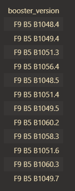

</div>
</div>

---

# 2015 Launch Records

<div class="columns">
<div>

#### SQL Query Overview

- **SQL Statement:**

  ```SQL
  select MONTHNAME(DATE) as Month, landing__outcome, booster_version, launch_site
  from SPACEXDATASET where DATE like '2015%'
  AND landing__outcome like 'Failure (drone ship)'select DISTINCT LAUNCH_SITE from SPACEXDATASET
  ```

- **Overview:** Analysis of unsuccessful Stage 1 landings on a drone ship during 2015.
- **Data Points:** Includes Month, Landing Outcome, Booster Version, Payload Mass (kg), and Launch Site.
- **Occurrences:** Recorded two instances in the year.
- **Query Specifics:** Utilized the `WHERE` keyword to isolate incidents with failed landing outcomes exclusively in 2015.

</div>
<div>

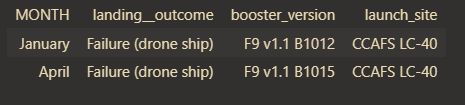

</div>
</div>

---

# Rank Landing Outcomes Between 2010-06-04 and 2017-03-20

<div class="columns">
<div>

#### SQL Query Overview

- **SQL Statement:**

  ```SQL
  select landing__outcome, count(*) as count from SPACEXDATASET
  where Date >= '2010-06-04' AND Date <= '2017-03-20'
  GROUP by landing__outcome ORDER BY count Desc
  ```

- **Objective**: Rank landing outcomes, specifically `Failure (drone ship)` and `Success (ground pad)`, in descending order within the specified dates.
- **Date Range**: 2010-06-04 to 2017-03-20.
- **Outcome Types**: Two types - Drone ship and Ground pad landings.
- **Results**:
  - Total Successful Landings: 8.
- **Query Method**:
  - Utilized `WHERE` with `BETWEEN` for date filtering.
  - Applied `GROUP BY` and `ORDER BY DESC` for organizing results.

</div>
<div>

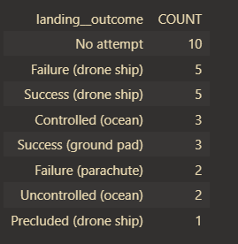

</div>
</div>

---

# Section 3

# Launch Site Proximities Analysis

---

# Launch Sites

<div class="columns">
<div>

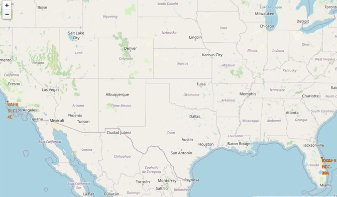

- Displays all SpaceX launch sites on the US map.
- **Location:** All sites are strategically positioned near the ocean, predominantly in Florida and California.

</div>

<div>

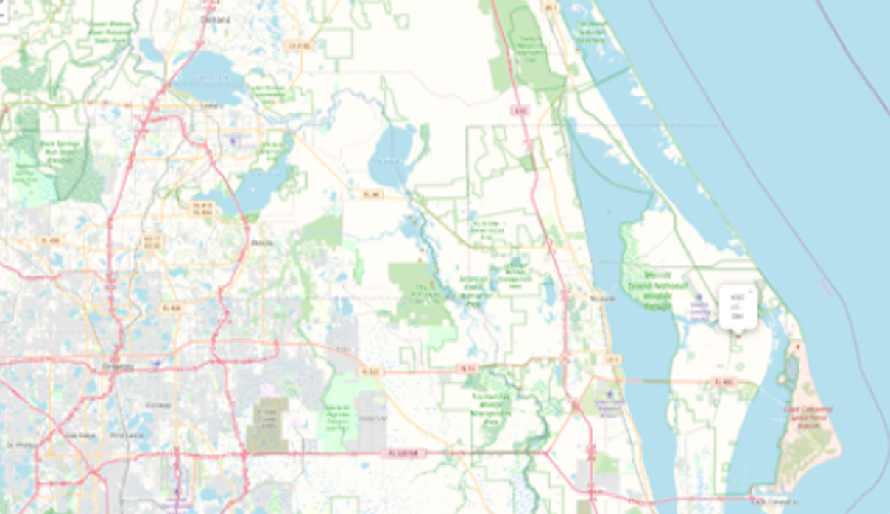

- Focuses on the two closely situated launch sites in Florida.

</div>
</div>

---

# SUCCESS/FAILED LAUNCHES

<div class="columns">
<div>

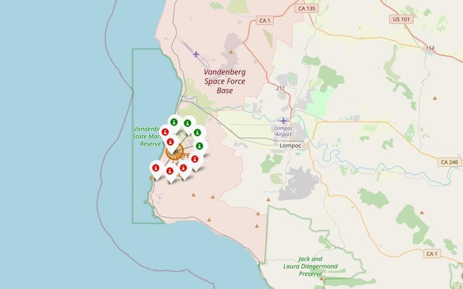

- **Interactivity**: Clickable clusters display landing outcomes.
- **Icons**: Green for successful landings, Red for failures.
- **Example**: VAFB SLC-4E - 4 successful, 6 failed landings.

</div>

<div>

- VAFB SLC-4E
  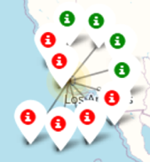

- KSC LC-39A

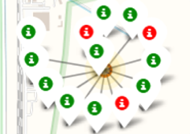

</div>
</div>

---

# SUCCESS/FAILED LAUNCHES

<div class="columns">
<div>

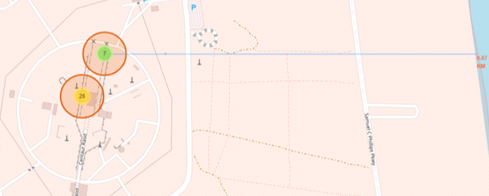

#### Launch Site Proximity Analysis

- **Coastline Distance:** Located merely 0.87 km due East.
- **Highway Accessibility:** The closest highway is just 0.59 km away.
- **Railway Proximity:** Nearest railway station situated at a distance of 1.29 km.
- **City Distance:** Maintains a significant separation of 51.74 km from the nearest city.

</div>

<div>

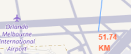

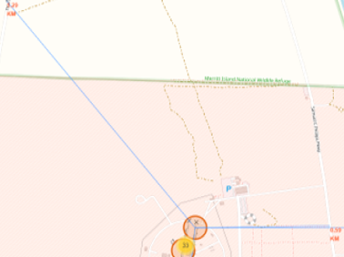

</div>
</div>

---

# Section 4

# Build a Dashboard with Plotly Dash

---

# Launch success count for all sites

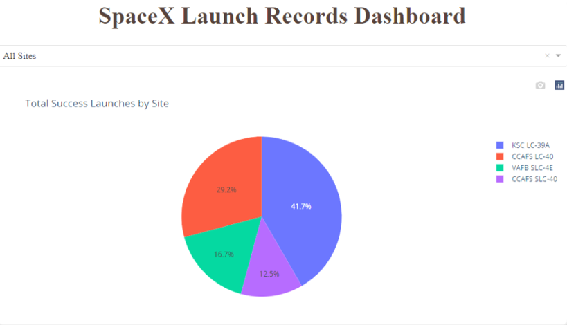

- **Overview**: Distribution of successful landings at different launch sites.
- **Key Sites**:
  - **CCAFS LC-40** (formerly CCAFS SLC-40) and **KSC**: Equal number of successful landings.
  - Majority occurred before CCAFS LC-40's name change.
- **Lowest Success**: VAFB, likely due to fewer attempts and increased launch challenges on the west coast.
- **Top Performer**: KSC LC-39 A, accounting for 41.7% of all successful launches.

---

# Highest Success Rate Launch Site

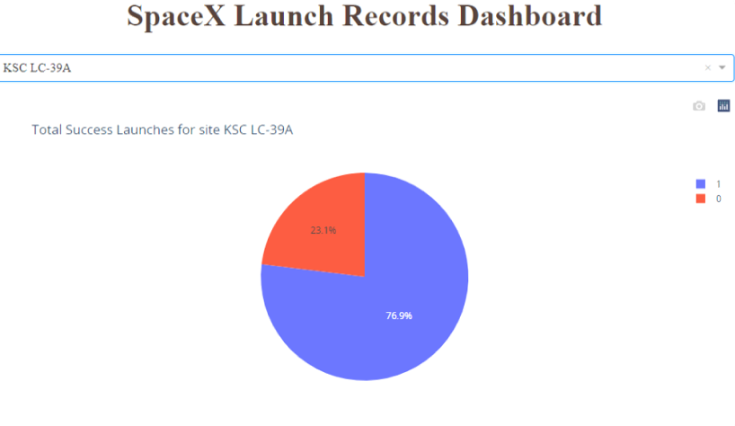

#### KSC LC-39A Launch Success Rate

- **Success Rate:** 76.9%
- **Record:** 10 successful landings, 3 failures
- **Highlight:** Best performance in successful launches

---

# Highest Success Rate Launch Site

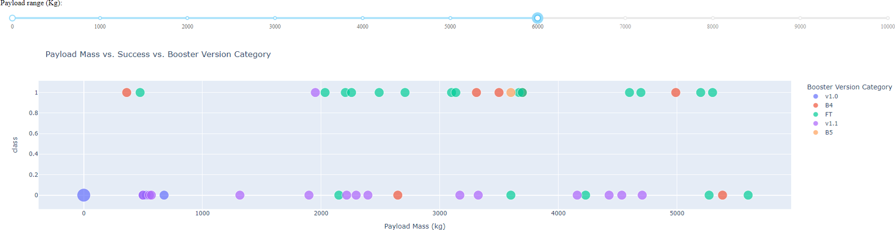

## Launch Outcome vs. Payload Analysis

- **Dashboard Overview**: Utilizes a Plotly dashboard scatter plot, highlighting launch outcomes against payload weights across all launch sites.
- **Payload Range Selector**: Configured from 0 to 10,000 kg, despite the maximum payload capacity being 15,600 kg.
- **Success Indicator**: Classifies launches as successful (1) or failed (0).
- **Booster Version and Launch Frequency**: Differentiated by color and point size, respectively.
- **Key Observations**:
  - In the 0-6,000 kg range, two failed landings occurred with zero kg payloads.
  - A noticeable gap around 4,000 kg suggests splitting data into two categories:
    1. Low Payloads (0 – 4,000 kg)
    2. Massive Payloads (4,000 – 10,000 kg)

---

# Section 5

# Predictive Analysis (Classification)

---

# Classification Accuracy

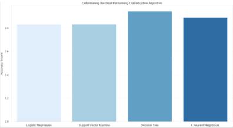

## Model Comparison Summary

- **Test Accuracy:** All models achieved ~83.33% accuracy on a small test set (18 samples), suggesting potential accuracy variance.
- **Observation:** Decision Tree Classifier showed variable accuracy in repeated tests.
- **Requirement:** Larger data set needed for definitive model evaluation.
- **Results:**
  - Decision Tree Model had the highest accuracy.
  - Accuracy Score: 94.44%
  - Best Score: 90.36%

---

# Confusion Matrix

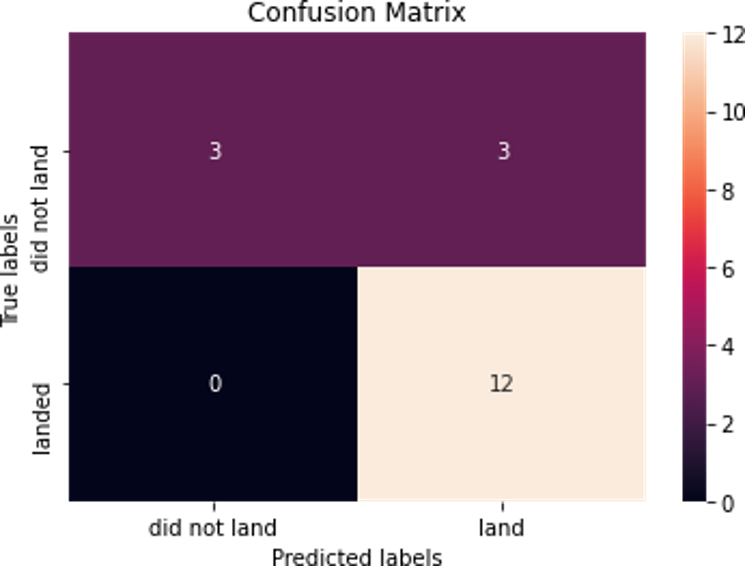

### Model Performance Summary

- All models exhibited identical performance on the test set, leading to a consistent confusion matrix.
- Correct Predictions:
  - 12 successful landings correctly identified.
  - 3 unsuccessful landings accurately detected.
- Incorrect Predictions:
  - 3 cases of successful landings were misclassified as unsuccessful (false positives), indicating a tendency of the models to overpredict successful outcomes.
- Top Model:
  - The Decision Tree model stands out with a high accuracy rate of 94.44%.
  - Analysis of the confusion matrix reveals that only 1 out of 18 predictions was a false positive, while the remaining 17 were accurate (5 unsuccessful, 12 successful landings).

---

# Conclusion

## Machine Learning Model Development for Space X

- **Objective:** Develop a model to predict successful Stage 1 landings, targeting savings of approximately $100 million USD.
- **Data Sources:** Utilized SpaceX public API and SpaceX Wikipedia page for data collection.
- **Data Processing:**
  - Stored information in a DB2 SQL database.
- **Visualization:** Implemented a dashboard for data interpretation.
- **Application:** Enables Space Y's Allon Mask to foresee Stage 1 landing outcomes, informing launch decisions.
- **Future Recommendations:** Gather more data to refine the model and enhance predictive accuracy.

### Insights from Data Analysis

- **Launch Site Success Rates:**
  - Success rate improves with increased flight experience.
  - KSC LC-39 A site leads with 41.7% of total successful launches and a 76.9% success rate.
- **Orbit Types and Payloads:**
  - Highest success rates (100%) in ES-L1, GEO, HEO, and SSO orbits.
  - SSO notable with 5 successful flights.
  - Higher success with heavier payloads in PO, ISS, and LEO orbits.
  - VLEO associated with heavier payloads.
  - Lower success rate for payloads over 4000kg.
- **Model Efficacy:** Decision Tree model outperforms with 94.44% accuracy.
